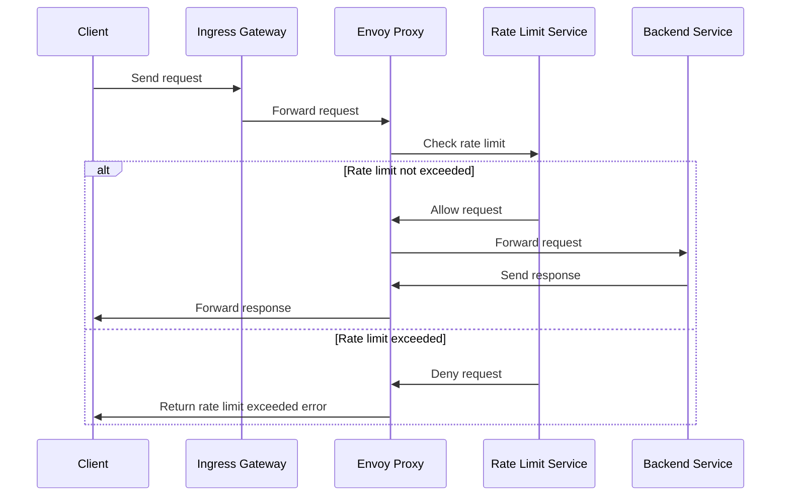

---
layout: post
title: "Istio local rate limiting"
author: "Zhihuz"
header-style: text
tags: [Tech, Networking, Istio, K8s]
---  

### Global or Local rate limits

Envoy supports two kinds of rate limiting: global and local. Global rate limiting uses a global gRPC rate limiting service to provide rate limiting for the entire mesh. Local rate limiting is used to limit the rate of requests per service instance. 

__Advantages of implementing rate limits include__:

1. Improved service stability: Prevents individual clients from overwhelming the system.
2. Enhanced security: Helps mitigate DDoS attacks and other malicious traffic patterns.
3. Better resource allocation: Ensures fair distribution of resources among all clients.
4. Reduced latency: Prevents service degradation during traffic spikes.
5. Granular control: Allows fine-tuning of limits for specific endpoints or services.

### Local Rate Limit

- Reduces load per pod/Envoy proxy
- Set up rate limiter per pod
- More cost-effective and reliable
- Operates at the proxy level without extra components
- Limited to exact paths and headers

### Global Rate Limit



- Can set up rate limiting based on client IP
- Easier to set up path or header-based rate limiters
- Allows regex matching for paths and headers
- Requires additional components (e.g., rate limiter service and redis)

### Summary

- Use local rate limiting to reduce load per pod and for a more efficient setup.
- Use global rate limiting for IP-based limiting, more flexible path/header matching, and limit across multiple instances.

Local rate limits are sufficient for our CCS cases, as our goal is to manage the load effectively rather than block malicious clients.

### Configuration
After conducting a series of tests, I have compiled examples for both `HTTP` and `gRPC` services, taking into account various scenarios to ensure the efficiency and reliability under different conditions.

### Rate Limits for Http Route

```yaml
apiVersion: networking.istio.io/v1alpha3
kind: EnvoyFilter
metadata:
  name: filter-local-ratelimit-svc
  namespace: istio-system
spec:
  workloadSelector:
    labels:
      app: productpage
  configPatches:
    - applyTo: HTTP_FILTER
      match:
        context: SIDECAR_INBOUND
        listener:
          filterChain:
            filter:
              name: "envoy.filters.network.http_connection_manager"
      patch:
        operation: INSERT_BEFORE
        value:
          name: envoy.filters.http.local_ratelimit
          typed_config:
            "@type": type.googleapis.com/udpa.type.v1.TypedStruct
            type_url: type.googleapis.com/envoy.extensions.filters.http.local_ratelimit.v3.LocalRateLimit
            value:
              stat_prefix: http_local_rate_limiter
    - applyTo: HTTP_ROUTE
      match:
        context: SIDECAR_INBOUND
        routeConfiguration:
          vhost:
            name: "inbound|http|9080"
            route:  
              action: ROUTE
      patch:
        operation: MERGE
        # Applies the rate limit rules.
        value:
          route:
            rate_limits:
              - actions: 
                # source_cluster & destination_cluster
                # - source_cluster: {} 
                # - destination_cluster: {}
                - remote_address: {}
              # exact match, not support "/path?k=v"
              - actions:
                # - request_headers:
                #     header_name: x-envoy-downstream-service-cluster
                #     descriptor_key: client_cluster
                - request_headers:
                    header_name: ":path"
                    descriptor_key: path
              # prefix match, support "/path?k=v"
              - actions:
                - header_value_match:
                    descriptor_value: "ip"
                    expect_match: true
                    headers:
                      - name: :path
                        string_match:
                          prefix: /ip
                          ignore_case: true
              # regular expression match
              - actions: 
                - header_value_match:
                    descriptor_value: "status"
                    expect_match: true
                    headers:
                      - name: :path
                        string_match:
                          safe_regex:
                            google_re2: {}
                            regex: "^/status/v\\d/.*"
          typed_per_filter_config:
            envoy.filters.http.local_ratelimit:
              "@type": type.googleapis.com/envoy.extensions.filters.http.local_ratelimit.v3.LocalRateLimit
              stat_prefix: http
              # global token_bucket settings, all routes contribute to consume this quota.  
              token_bucket:
                max_tokens: 2147483647
                tokens_per_fill: 2147483647
                fill_interval: 60s
              # This adds the ability to see headers for how many tokens are left in the bucket, how often the bucket refills, and what is the token bucket max.
              enable_x_ratelimit_headers: DRAFT_VERSION_03
              filter_enabled:
                runtime_key: http_local_rate_limiter
                default_value:
                  numerator: 100
                  denominator: HUNDRED
              filter_enforced:
                runtime_key: http_local_rate_limiter
                default_value:
                  numerator: 100
                  denominator: HUNDRED
              response_headers_to_add:
                - append: false
                  header:
                    key: x-local-rate-limit
                    value: "true"
              descriptors:
                - entries:
                    # - key: client_cluster
                    #   value: foo
                    - key: path
                      value: /aaa
                  token_bucket:
                    max_tokens: 3
                    tokens_per_fill: 3
                    fill_interval: 60s
                - entries:
                    - key: header_match
                      value: ip
                  token_bucket:
                    max_tokens: 2
                    tokens_per_fill: 2
                    fill_interval: 60s
                - entries:
                    - key: header_match
                      value: status
                  token_bucket:
                    max_tokens: 5
                    tokens_per_fill: 5
                    fill_interval: 60s
```

This EnvoyFilter configures local rate limiting for the `productpage` app which is part of Istio official samples `bookinfo` . We can check the configuration by `istioctl pc listener productpage-v1-b679889c5-4t42w -ojson | grep "httpFilters" -A 10` .

1. It configures rate limiting rules for HTTP routes on the inbound virtual host for port 9080
2. Rate limit actions are based on:
    - Remote address, client clusters
    - Request path (exact match)
    - Path prefix "/ip" (case-insensitive)
    - Path regex matching "/status/v\d/*"
3. Specific rate limits are set for different paths:
    - "/aaa": 3 requests per minute
    - Paths starting with "/ip": 2 requests per minute
    - Paths matching "/status/v\d/.*": 5 requests per minute

### Rate limits for gRPC method

```yaml
apiVersion: networking.istio.io/v1alpha3
kind: EnvoyFilter
metadata:
  name: app1-local-ratelimit-grpc
  namespace: istio-system
spec:
  workloadSelector:
    labels:
      app: app1
  configPatches:
    - applyTo: HTTP_FILTER
      match:
        context: SIDECAR_INBOUND
        listener:
          filterChain:
            filter:
              name: "envoy.filters.network.http_connection_manager"
      patch:
        operation: INSERT_BEFORE
        value:
          name: envoy.filters.http.local_ratelimit
          typed_config:
            "@type": type.googleapis.com/udpa.type.v1.TypedStruct
            type_url: type.googleapis.com/envoy.extensions.filters.http.local_ratelimit.v3.LocalRateLimit
            value:
              stat_prefix: grpc_local_rate_limiter
    - applyTo: HTTP_ROUTE
      match:
        context: SIDECAR_INBOUND
        routeConfiguration:
          vhost:
            name: "inbound|http|8079"
            route:  
              action: ANY
      patch:
        operation: MERGE
        # Applies the rate limit rules.
        value:
          route:
            rate_limits:
              - actions: 
                # source_cluster & destination_cluster
                # - source_cluster: {} 
                # - destination_cluster: {}
                - remote_address: {}
              - actions:
                # - request_headers:
                #     header_name: x-envoy-downstream-service-cluster
                #     descriptor_key: client_cluster
                - request_headers:
                    header_name: ":path"
                    descriptor_key: path
          typed_per_filter_config:
            envoy.filters.http.local_ratelimit:
              "@type": type.googleapis.com/envoy.extensions.filters.http.local_ratelimit.v3.LocalRateLimit
              stat_prefix: grpc
              # global token_bucket settings, all routes contribute to consume this quota.  
              token_bucket:
                max_tokens: 2147483647
                tokens_per_fill: 2147483647
                fill_interval: 60s
              # This adds the ability to see headers for how many tokens are left in the bucket, how often the bucket refills, and what is the token bucket max.
              enable_x_ratelimit_headers: DRAFT_VERSION_03
              filter_enabled:
                runtime_key: grpc_local_rate_limiter
                default_value:
                  numerator: 100
                  denominator: HUNDRED
              filter_enforced:
                runtime_key: grpc_local_rate_limiter
                default_value:
                  numerator: 100
                  denominator: HUNDRED
              response_headers_to_add:
                - append: false
                  header:
                    key: x-local-rate-limit
                    value: "true"
              descriptors:
                - entries:
                    # - key: client_cluster
                    #   value: ratings
                    - key: path
                      value: "/fgrpc.PingServer/Ping"
                  token_bucket:
                    max_tokens: 3
                    tokens_per_fill: 3
                    fill_interval: 60s
```

This EnvoyFilter configures local rate limiting for the `app1` application which runs [Fortio](https://github.com/fortio/fortio)  in the istio-system namespace:

1. Targets inbound traffic on gRPC listening port 8079
2. Implements rate limiting based on client cluster and request path
3. Sets a specific limit for the gRPC method `/fgrpc.PingServer/Ping`: 3 requests per minute

### Showcase

When the local rate limit is triggered, the response header will include `x-local-rate-limit: true`.

```bash
# local rate limit is triggered for http route `/aaa`
> curl -X GET -I -s https://productpage:9080/aaa
HTTP/2 200 
...
x-local-rate-limit: true
x-ratelimit-limit: 3
x-ratelimit-remaining: 0
x-ratelimit-reset: 48
...

# local rate limit is triggered for grpc method GetWatchingStatus with a grpcurl client
> grpcurl -v -plaintext app1:8079 fgrpc.PingServer.Ping
...
x-local-rate-limit: true
x-ratelimit-limit: 3
x-ratelimit-remaining: 0
x-ratelimit-reset: 2
...
```

### Metrics

The local rate limit filter outputs statistics in the `<stat_prefix>.http_local_rate_limit.` namespace. 429 responses (or the configured status code) are emitted once limited.

| **Name** | **Type** | **Description** |
| --- | --- | --- |
| enabled | Counter | Total number of requests for which the rate limiter was consulted |
| ok | Counter | Total under limit responses from the token bucket |
| rate_limited | Counter | Total responses without an available token (but not necessarily enforced) |
| enforced | Counter | Total number of requests for which rate limiting was applied (e.g.: 429 returned) |

#### Access log
It's highly recommended to enable access logging, with sampling, to track the behavior of the rate limit filter. Below is an example configuration to enable access logging for the `productpage` app in Istio.

```yaml
# Enable access logging
- applyTo: NETWORK_FILTER
  match:
    context: SIDECAR_INBOUND
    listener:
      filterChain:
        filter:
          name: envoy.filters.network.http_connection_manager
  patch:
    operation: MERGE
    value:
      typed_config:
        "@type": type.googleapis.com/envoy.extensions.filters.network.http_connection_manager.v3.HttpConnectionManager
        access_log:
          - name: envoy.access_loggers.file
            filter:
              and_filter:
                filters:
                  - response_flag_filter:
                      flags:
                        - "RL" # Indicates a rate-limit response
                  - runtime_filter:
                      runtime_key: "access_log_sampling_rate"
                      percent_sampled:
                        numerator: 1
                        denominator: HUNDRED # 1% sampling rate
            typed_config:
              "@type": "type.googleapis.com/envoy.extensions.access_loggers.file.v3.FileAccessLog"
              path: /dev/stdout
              log_format:
                json_format:
                  start_time: "%START_TIME%"
                  bytes_received: "%BYTES_RECEIVED%"
                  bytes_sent: "%BYTES_SENT%"
                  protocol: "%PROTOCOL%"
                  response_code: "%RESPONSE_CODE%"
                  response_code_details: "%RESPONSE_CODE_DETAILS%"
                  connection_termination_details: "%CONNECTION_TERMINATION_DETAILS%"
                  duration: "%DURATION%"
                  response_flags: "%RESPONSE_FLAGS%"
                  route_name: "%ROUTE_NAME%"
                  grpc_status: "%GRPC_STATUS%"
                  path: "%REQ(:PATH)%"
                  method: "%REQ(:METHOD)%"
                  authority: "%REQ(:AUTHORITY)%"
                  downstream_host: "%DOWNSTREAM_REMOTE_ADDRESS_WITHOUT_PORT%"
                  upstream_host: "%UPSTREAM_HOST%"
                  upstream_cluster: "%UPSTREAM_CLUSTER%"
                  upstream_service_time: "%RESP(X-ENVOY-UPSTREAM-SERVICE-TIME)%"
                  upstream_transport_failure_reason: "%UPSTREAM_TRANSPORT_FAILURE_REASON%"
                  forwarded_for: "%REQ(X-Forwarded-For)%"
                  traceid: "%REQ(X-Request-Id)%"
                  version: "%REQ(Y-Ohai-Version)%"
                  level: error
                  mark: AccessLog
```

Explanation:
+ The response_flag_filter checks for rate-limited requests (with the RL flag).
+ percent_sampled defines the sampling rate (set to 1% here).
+ The log_format captures detailed information about each request.

Here's a sample access log for a gRPC method when a request is rate-limited:

```
{
  "response_code_details": "local_rate_limited",
  "traceid": "5a7940a2-a792-98c4-ba65-9bc3982b3371",
  "response_code": 200,
  "method": "POST",
  "level": "error",
  "grpc_status": "Unavailable",
  "bytes_received": 0,
  "bytes_sent": 0,
  "response_flags": "RL",
  "duration": 0,
  "start_time": "2024-09-09T03:12:34.869Z",
  "path": "/fgrpc.PingServer/Ping",
  "protocol": "HTTP/2",
  "upstream_cluster": "in_app1.<namespace>.svc.cluster.local_envoy-grpc_8079",
  "authority": "app1:8079",
  "downstream_host": "<ip>",
  "mark": "AccessLog"
}
```

This log provides detailed traceability for debugging and monitoring the local rate limit filter's activity.

### Troubleshooting

**Q**: How to resolve envoy exception “local rate descriptor limit is not a multiple of token bucket fill timer”

**A**: The local rate limit descriptor's token bucket fill interval must be a multiple of the global token bucket's fill interval** to avoid envoy exception “local rate descriptor limit is not a multiple of token bucket fill timer”. This means if your global rate limit is set to refill every 5 seconds, then the fill interval for each descriptor must be either 5 seconds or a multiple of 5 seconds (e.g., 10 seconds, 15 seconds, etc.).

**Q**: How to resolve Envoy exception “exited with error: signal: aborted (core dumped)”

**A**: Start by dumping the configuration with `istioctl pc listener <pod_name> -ojson > dump.json`. If there are rate limits for both HTTP and gRPC services, **a possible issue could be conflicting configurations**. Review the `dump.json` file and remove any redundant sections that should be shared between configurations.

**Q**: The rate limits don't work after applying the EnvoyFilter. 

**A**: Set `enable_x_ratelimit_headers: DRAFT_VERSION_03` to check if any rate limit-related headers appear in the response for better observability. If there are no rate limit headers, one possible reason could be the absence of a `stat_prefix` in either the `HTTP_FILTER` or `HTTP_ROUTE`.

**Q**: How do I manage routes like `method: GET & path: /api/book` and `method: GET & path: /api/bookinfo`, both of which might have multiple query strings?

**A**: To handle these cases, use prefix match actions. Ensure that `method: GET & path: /api/bookinfo` is listed before `method: GET & path: /api/book` in the `rate_limits.actions` list to prevent any unintended overrides.

### Reference

- [Enabling Rate Limits using Envoy](https://istio.io/latest/docs/tasks/policy-enforcement/rate-limit/#local-rate-limit)
- [envoyproxy/ratelimit](https://github.com/envoyproxy/ratelimit)
- [Local rate limit](https://www.envoyproxy.io/docs/envoy/latest/configuration/http/http_filters/local_rate_limit_filter#config-http-filters-local-rate-limit)
